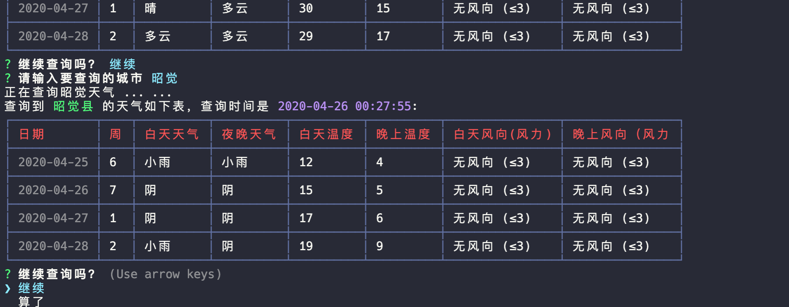

## 简单的天气查询 CLI
TypeScript 学习入门项目之一，可交互的、可以不断响应用户查询的cli工具.

### 使用

请确保您的机器上安装了 node、ts-node

安装本 cli ：`npm i  -g my-ts-weather`

之后执行 `my-ts-weather`，输入您要查询的城市即可

### 支持功能

1. 可以使用 `ts-weather` shell 命令开启查询，而不是用 `yarn start`。这里在bin/index.ts 中使用了`#!/usr/bin/env node`，需要 tsc 编译 ts 文件为 js，package.json 中 bin 应该执行的是编译后的 js 文件,而不是 ts 文件，否则 ts 文件的模块引入语法将在 cli 宿主机上运行的时候报错

2. 启动后可以一直响应用户输入查询下去。这里使用了连续传递回调函数和递归。

##### 使用了一下几个技术:

1. `inquirer.js` 实现可交互命令行
2. `husky` 钩子，在项目提交或者推到远程仓库之前运行一些代码检查、测试之类的操作
3. `cli-table3` 一款可以在命令行中绘制表格的工具
4. `colors` 在 node.js 控制台打印时加上色彩

